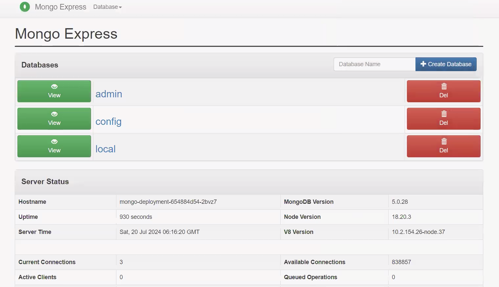

# MERN Stack Application Deployment on Kubernetes

This repository contains deployment configurations for a MERN stack application using Kubernetes on a Minikube cluster. This project utilizes official Docker images for MongoDB **mongo**, for UI by using Node and express **mongo-express**, enabling CRUD operations with a simple setup.

## Kubernetes Resources Used in Deployment

This deployment utilizes the following Kubernetes resources:

- **Deployment**: Manages the Mongo Express application deployment, ensuring the desired number of replicas.

- **StatefulSet**: Used for managing MongoDB instances, providing stable network identities and persistent storage.

- **Horizontal Pod Autoscaler**: Automatically scales the number of Mongo Express pods based on CPU utilization.

- **Service**: Exposes both MongoDB and Mongo Express applications, enabling communication between them and external access.

- **Secrets**: Stores sensitive data, such as MongoDB credentials, securely.

- **ConfigMaps**: Manages configuration data for Mongo Express, allowing for dynamic configuration updates.

- **Persistent Volume (PV)**: Represents storage resources for MongoDB data, ensuring data persistence.

- **Persistent Volume Claim (PVC)**: Requests storage resources defined by the Persistent Volume for MongoDB.

- **Namespaces**: Organizes resources within a specific namespace for better management and isolation.

- **Readiness Probes**: Checks the readiness of Mongo Express pods before routing traffic to them.

- **Liveness Probes**: Monitors the health of Mongo Express pods to ensure they are running properly.

- **Resource Quota**: Limits the resource usage for the namespace to prevent resource contention.

- **Deployment Strategies**: Defines how updates are applied to the deployment, ensuring minimal downtime.

- **Replicas**: Specifies the number of pod replicas for both MongoDB and Mongo Express to ensure availability.

These resources work together to provide a robust, scalable, and maintainable deployment for the MERN stack application.

## Architecture

Below is the architecture of this application, illustrating its key components and how they interact.


## Prerequisites

Before deploying the application, you need to install **Minikube** and **kubectl** on your system. Follow the steps below for installation on **Red Hat** or **Amazon Linux**.

## Installation Steps

### 1. Install Docker

Minikube uses a container runtime (like Docker) to run Kubernetes components and the applications deployed within the cluster. The container runtime is responsible for building, running, and managing containers.

```bash
yum install docker -y
systemctl start docker
```

### 2. Install Minikube

Run the following commands to install Minikube:

```bash
# Download the Minikube RPM package
curl -LO https://storage.googleapis.com/minikube/releases/latest/minikube-latest.x86_64.rpm

# Install the Minikube RPM
rpm -Uvh minikube-latest.x86_64.rpm

# Start Minikube (use --force to overwrite existing configurations if necessary)
minikube start --force
```

### 3. Install Kubectl

Next, install kubectl with the following commands:

```bash
# Download the kubectl binary
curl -O https://s3.us-west-2.amazonaws.com/amazon-eks/1.28.3/2023-11-14/bin/linux/amd64/kubectl

# Make the binary executable
chmod +x ./kubectl

# Move kubectl to a directory in your PATH
cp ./kubectl /usr/bin/

```

## Deployment Instructions

- After installing Minikube and kubectl, you can proceed to deploy the MERN stack application:

### 1. Download the repository

```bash
git clone https://github.com/Vikas-Prince/K8s-FullStack-Deployment.git
cd K8s-FullStack-Deployment
```

### 2. Create a Namespace

```bash
kubectl apply -f namespace.yml
```

### 3. Apply Persistent Volume and Persistent Volume Claim

First, apply the persistent volume and persistent volume claim for MongoDB:

```bash
cd database
kubectl apply -f persistent-volume.yml
kubectl apply -f persistent-volume-claim.yml
```

### 4. Apply Secrets

Next, create the secrets for MongoDB:

```bash
kubectl apply -f mongo-secret.yml
```

### 5. Apply ConfigMaps

Apply the ConfigMap for Mongo Express:

```bash
kubectl apply -f mongo-config.yml
```

### 6. Deploy MongoDB

Now, deploy the MongoDB StatefulSet and Service:

```bash
kubectl apply -f mongo-statefulset.yml
kubectl apply -f mongo-service.yaml
```

### 7. Deploy Mongo Express

Deploy the Mongo Express Deployment and Service:

```bash
kubectl apply -f mongo-express-deployment.yaml
kubectl apply -f mongo-express-service.yaml
```

### 8. Apply Horizontal Pod Autoscaler

To enable Horizontal Pod Autoscaling (HPA) for Mongo-Express, you must first ensure that the Metrics Server is properly set up in your Kubernetes cluster. The Metrics Server is crucial as it collects resource metrics from Kubelets and provides them to the HPA.

1. **Install Metrics Server**
   - Run the following command to apply the Metrics Server configuration:

```bash
kubectl apply -f https://github.com/kubernetes-sigs/metrics-server/releases/latest/download/components.yaml
```

2. **Modify Metrics Server Deployment**
   - After installing the Metrics Server, you may need to modify its deployment to allow insecure TLS communication with Kubelets. To do this, run:

```bash
kubectl edit deployment metrics-server -n kube-system
```

- In the editor, find the spec.containers.args section and modify it to include the following:

```bash
--kubelet-insecure-tls
--kubelet-preferred-address-types=InternalIP,ExternalIP,Hostname
```

- After modification we need to restart the metric server

```bash
kubectl rollout restart deployment metrics-server -n kube-system
```

Once the Metrics Server is set up, you can apply the HPA configuration for Mongo-Express. Create a file named mongo-express-hpa.yaml with the desired configuration, then run:

```bash
kubectl apply -f mongo-express-hpa.yaml
```

### 9. Verify Deployments and Services

Check the status of your deployments and services to ensure everything is running correctly:

```bash
kubectl get pods -n mernstack
kubectl get services -n mernstack
```

### 10. Accessing Mongo Express

To access the Mongo Express web interface, follow these steps:

1. **Run the `socat` script:**
   Make sure the script is executable, and then execute it with the following commands:

```bash
   chmod +x socat.sh
   ./socat.sh
```

2. **Access the Application:**
   - Once the script is running, you can access the Mongo Express interface via your public IP and the designated port.
3. **Login Credentials**
   - **Username:** admin
   - **Password:** pass

### 11. Application Web View

You can access the web view of your application by visiting the public IP of your server with respective port.

- Below is a screenshot of the application after successful deployment via Kubernetes.



## Conclusion

Following these steps, you should have successfully deployed MongoDB and Mongo-Express on your minikube cluster. You can now access the Mongo Express web interface to interact with your MongoDB database.
